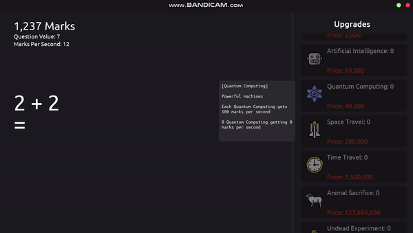
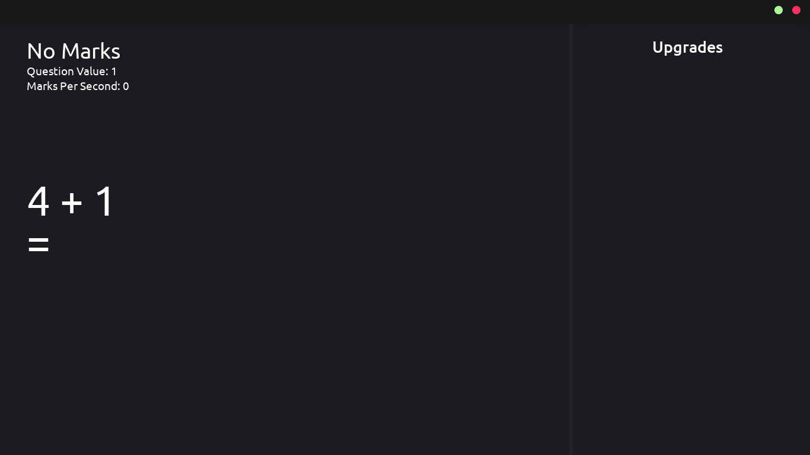
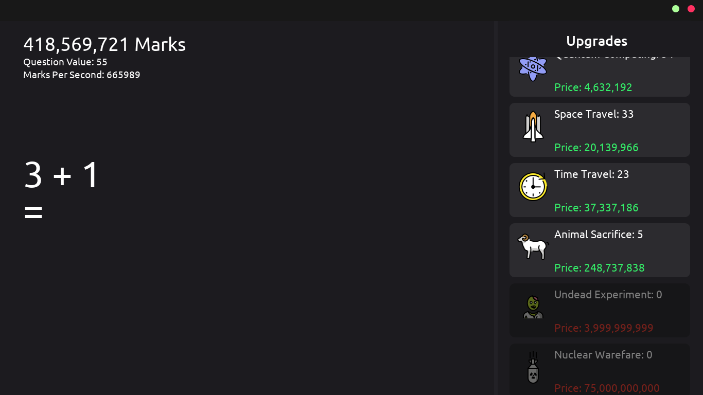

# Mental Maths Builder

This computer application was made for a school project to help people build their mental math skills. GameMaker Studio 2 was the engine used to make this project. I chose to use this engine considering the limited amount of time I had to make this game for my school project.

---

</img>

Inspired by the game Cookie Clicker by Orteil, this takes a different approach. Instead of clicking cookies, you solve simple maths questions to earn marks which you can spend on upgrades to get more marks. 

The end goal is to have the most marks.

      

---

  <em>Jump to:  <a href="#features">Features</a> — <a href="#screenshots">Screenshots</a> — <a href="#Stages of Software Development Life Cycle (SDLC)">SDLC</a> — <a href="#how-do-i-get-it">Download</a></em>

## Things to Add
* Large number representation e.g. "10 Million" ✔️
* More arithmetic, 3 remaining e.g. "Subtraction, Multiplication, Division" ✔️
* Each upgrade should be hidden until the user reaches a certain stage. ✔️
* Question solve indication effect.
* Saving & Loading
* Achievements
* Settings

## Screenshots

</img>
Start game example
   

</img>
Late game example

## Stages of Software Development Life Cycle (SDLC)

### Requirements
Aiming to produce a software that can help people improve their mental math skills in a fun way. The user needs the software to give them questions that they can answer, which allows them to progress the game by buying "upgrades" allowing them to get higher "marks". The project needs to give the player questions which can be answered giving them points to purchase upgrades which increase "marks per second" this adds to the idle aspect of the game.

### Design Documentation
The program must have a system of giving the user a question so that they can answer it and receive points for doing so. The questions must be simple in the beginning but get harder as the user progresses. 

I first wanted question types addition, multiplication and division to be given at random when playing. Instead the user will be able to choose between addition, multiplication, or division.

One design concern I had was if I should make my own titlebar or use the default windows titlebar. Making titlebars in gamemaker is not easy but I chose to make my own since it looks better aesthetically. I took inspiration from the Mac OS titlebar icons and implemented it in to my program.

Photoshop CC was used to design the user interface. The .psd file can be found in [resources/interface.psd](resources/interface.psd). At the moment, the view is static so there is only one room in the program. There will be a scroll area for the upgrades.

Used Github user Akseli Palén's [open emoji spritesheets](https://github.com/axelpale/openmoji-spritemap-generator) to add emoji icons for the upgrades.

### Technical Documentation

</img>

Using code comments is useful for me, almost every line of code in my project has been commented with a simple description of its behaviour.

There is one object/class in the program at the moment, which is the upgrade's and within that contains information about its name, quantity, price. A tooltip can be created when hovering over upgrade button displaying information and statistics about the upgrade.

The first thing I implemented into the game was the titlebar. To do this, I made sure the game always runs in borderless windowed mode, then I draw a rectangle in the GUI layer (topmost) with a height of 40 pixels and a width of the window starting at the top left. After this I added the two icons in the top right which minimise and close the game. One problem was that GameMaker Studio 2 doesn't have a built in function to minimise the window. So I used YellowAfterLife's [window command scripts](https://yal.cc/gamemaker-window-commands-extension/) which can be called to manipulate the game window.

Then I worked on the maths questions and functionality for the user to type and answer it. This was achieved by using the GML (Game Maker Language) built in variable [keyboard_string](http://127.0.0.1:51290/index.htm#t=GameMaker_Language%2FGML_Reference%2FGame_Input%2FKeyboard_Input%2Fkeyboard_string.htm) which holds the last 1024 characters typed and returns a string of it (not read only). The user can type a maximum of 2 characters in the text area and when they press enter the answer is checked, if correct the user is rewarded with "Marks". If incorrect, the user must retype their answer.

The upgrades were the most recent addition to the software, first when the game begins all the upgrades are constructed and put into a list called upgrades[]. Then when ever the user gets a question right, in a loop it checks if the upgrade_stage (how many questions must be solved to create this upgrade) is equal to the questions_solved. If the depending on the value of the loop increment upgrades[i] is created and assigned its values.

I had to make sure the upgrades were priced so that the game was addicting and challenging. So I look at some game design articles: 
* [Numbers Getting Bigger: The Design and Math of Incremental Games](https://gamedevelopment.tutsplus.com/articles/numbers-getting-bigger-the-design-and-math-of-incremental-games--cms-24023)
* [The Math of Idle Games, Part 1](https://blog.kongregate.com/the-math-of-idle-games-part-i/)

I added a developer_mode boolean variable which helps me test new features quickly since I can increase the 

### Test - Plan and Report
|Test Criteria|Date|Outcome|
|-------------|----|-------|
|Dragging titlebar to different monitor|14/07/2021|Game lags alot when dragging towards the second monitor. Need to find a fix for this|
|Retest Dragging titlebar to different monitor|15/07/2021|Found a fix for this now works perfect. See commit list for changes|
|Checking if only numbers can be typed in to the text area|18/07/2021|Only numbers can be entered, unsure about numpad keys|
|Does it work after being exported as .exe|18/07/2021|Works as executable|
|Does the tooltip come up when the upgrade is hidden behind the upgrades heading|20/07/2021|The tooltip still comes up when hovering over the upgrades heading area. Gonna leave this bug in, doesn't effect the user experience too much|
|Do all of the upgrades get created when the total_marks exceed all the upgrade[i].creation values.|20/07/2021|All of the upgrades get created

### Release and Maintain - User Documentation
**How to install and start program:**
* Download zip file or installer.
* Run installer or extract zip file.
* Run the .exe file

**How to play:**
* The question area is on the left, you can type the answer and press enter to submit it.
* Keep answering questions until you can purchase an upgrade. The "Pencil" upgrade increases your "Question Value", which is how many "Marks" you get per question. All the other upgrades increase your "Marks Per Second" which increases your "Marks" every second, even when idle.
* You can choose what type of questions you want to have e.g. Addition, Subtraction, Multiplication, or Division. Under the question area.

## How Do I Get It
The download will be in the releases section.

 

> This project is licensed under the terms of the MIT license.

